# Parkinson's disease Mini-project
This README file contains the presentation to explain the project
### Steffen Lehmann. 


## Parkinson's disease Mini-project
A detection problem

22 features

Status:
```
● (one) - Parkinson's
● (zero) - Healthy
```

## Feature selection - Correlation check

<p align="left">
  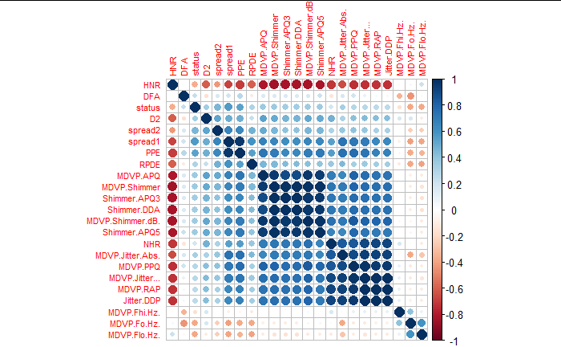
</p>

```
● Removed labels + names
● Removed > 0.9 correlated features
● Top down approach to feature selection
● From 22 to 11 features
```

## Standardizing the data

z = (x - u) / s
```
● u = mean of the samples
● s = SD of the samples
```
Raw Data             | Standardized Data
:-------------------------:|:-------------------------:
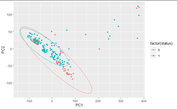  |  


## Normality check and distributions
```
● Shapiro-Wilk test of normality
● Means and variance
● Histograms
● Means and Covariance
```
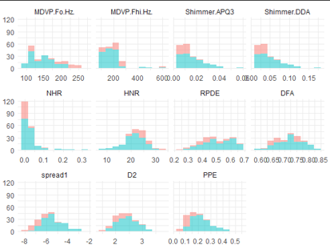 
                        

## Dimensionality reduction: PCA - unsupervised
```
● Before and after removing the highly correlated features
● Visualised using PCA (n=2)
```

22 features            | 11 features
:-------------------------:|:-------------------------:
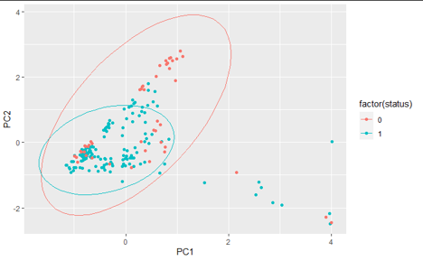  |  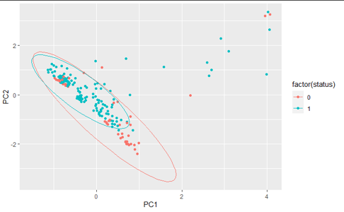


## Dimensionality reduction: PCA - unsupervised
```
● After removing > 0.9 correlated features
● Features = 11
● Retained 0.95 of the variance
● 7 PCs
```
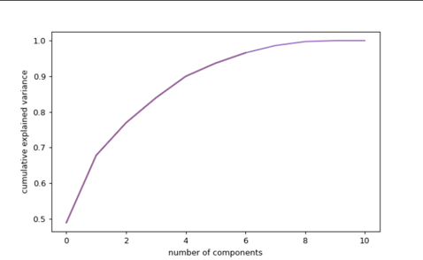


## Principal Component Analysis
```
● The most important features in the covariance matrix
● Biggest contributors to eigenvalue (scaler)
```


## Detection Problem using supervised methods

```
● ## Detection Problem using supervised methods
● K fold (interactions): 5
● R80/20 split
● Supervised Methods
    ● Gaussian naive bayes
    ● Support vector Machine
    ● Random forest
    ● Neural network
● On 11 and 7 features
```
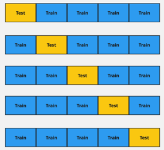


## Gaussian Naive Bayes

```
● Priors
    ● 0.25 for Healthy
    ● 0.75 for Parkinson’s
● Variance and mean
```
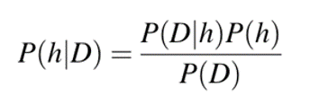


```
● P(h): the probability of hypothesis h being true
  (regardless of the data). This is known as the
  prior probability of h.
● P(D): the probability of the data (regardless of
  the hypothesis). This is known as the evidence.
● P(h|D): the probability of hypothesis h given
  the data D. This is known as posterior
  probability.
● P(D|h): the probability of data d given that the
  hypothesis h was true. This is known as
  posterior probability.
```

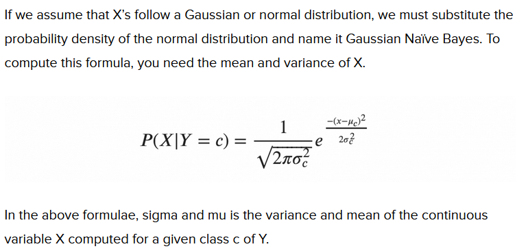

## Support Vector Machine Classifier - Supervised


```
● Cn= Parkinson’s and healthy
● Not the actual model
● Margins
```
SVM Math        | 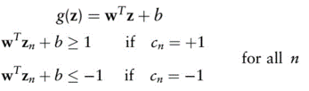
:-------------------------:|:-------------------------:
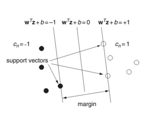  |  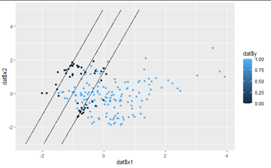
## Confusion Matrix: Was the sample Healthy or not?
```
● The SVM model
● T threshold
● FP better than FN?
```


## Accuracy scores

Worse accuracy with 22 features

```
SVC RFC NN GNB
Standard (11) 82% (0.06) 79% (0.07) 79% (0.02) 74 % (0.05)
PCA (7) 80% (0.06) 83% (0.08) 81% (0.04) 77% (0.03)
```

